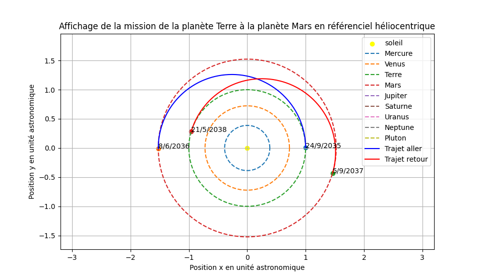

# **StellarVoyager**, calculateur de trajectoire orbitale

## Description
Le but du projet est de calculer la trajectoire entre deux planètes la moins consommatrice de carburant.
Il introduit **l'orbite de Hohmann** qui illustre la technique. 
Le principe est de partir au moment optimum pour profiter du mouvement de l'orbite initiale.
Les moteurs sont alors utilisés deux fois, la première fois pour **accélerer et sortir de l'attraction** de la planète initiale, et la seconde fois pour **freiner et rentrer dans l'orbite** de la planète visée.

> *La caractéristique clé de la trajectoire de Hohmann est que l'angle entre le point de départ sur l'orbite intérieure et le point d'arrivée sur l'orbite extérieure est de 180 degrés. Cela signifie que l'engin spatial atteindra l'orbite extérieure exactement à l'opposé de son point de départ initial.*
*Cette propriété de 180 degrés entre le départ et l'arrivée est importante pour minimiser la dépense énergétique lors des transferts orbitaux. En exploitant la mécanique orbitale et en choisissant soigneusement les moments des impulsions de propulsion, les missions spatiales peuvent atteindre leur destination en utilisant le moins de carburant possible.*

![Orbite de Hohmann entre la Terre et Mars](data:image/jpeg;base64,/9j/4AAQSkZJRgABAQAAAQABAAD/2wCEAAoHCBMVFBQVFBUXGBcYGhceHBoZGR0XFxcaFxkYGBceICAaICwjGh0pIBcXJDYkKS0vMzMzGSI4PjgwPSwyMy8BCwsLDw4PHhISHTIlIiQyLzQ6My8yMjozMjI6MjM4OjI6LzIyPTIyPTI0Mj09OjI9LzIyMzIyNC8vMjI6MjIyMv/AABEIAN0A3QMBIgACEQEDEQH/xAAcAAEAAgMBAQEAAAAAAAAAAAAABQYDBAcBAgj/xABOEAACAQMBBQQECgUGDQUAAAABAgMABBEhBQYSMUETIlFhMnGBkQcUIzNCUlNigqFyg5KisSRDY3OywRU0RFSTlKOz0dLh8PEWJTW0w//EABoBAQACAwEAAAAAAAAAAAAAAAACBQEDBAb/xAAnEQEBAQACAAYCAQUBAAAAAAAAAQIDEQQFEiExQVFhgXGRsdHhIv/aAAwDAQACEQMRAD8A4zSlKBSlKBSlKBSlTWytgSzL2h4YoR6U0p4Ix5A83P3VyaCFqU2bsK5uMmGF3Uc2Awg9bHuj31INd2VsfkI/jMg/nJ14YgfFIge9+M/hqP2nty5uMCWVmUeigwka/oomFHsFBvHYMEf+M3kSn6kINw/vXEY/arw3WzU9CCaY/WlkEa/sRDP71V6lBYP/AFCij5OztE8zG0xP+mZq+7beifjXCW2MgcJtYCuunLs/76rlZIyQRjnkY660Fq3j25PFd3MSrbgRSyRjFrAARGxTOOzPPGfbWj/6nc6yW9nJ67dE/OLhNR+2pJWuJ2mHDK0shkXGOGQuS4x0w2aj6CwrtSyf52yC+cEzoR7JOMV6NnbPk+bu3ib6txF3f9JCW/NRVdpQT9xutdKpdEWaMal4HWZQPPgOV9oFQRU1ntbl42DxuyMOTKxVh7RV33YD3somu+CQRYHzaK0jHXLlADIRp6Wf41Dk5Jx4ur9NvFxa5NzM+1Pg2TcSLxJDKy+KozL7wK1XUg4IwR7CDXeRIuAAcDlzx7Kre9uxo5oZGCgSxgsr/SYKMurH6enLw99cPF5jN79NnUrv5PLbnFsvdjklKUqxVZSlKBSlKBSlKBSlKBWe3gaR1RFLMxwFUZYnwArPs3Z8k7hI1y3MnkqKObMeSqOpNTNztKK2RobM5YgrLckcLuOqx/Zppz9JvyoPkWtvZ5M4We4HKIHMMTf0rD5xh9munielRW1NqzXDhpZC2NFHJEXwVRoo8hUfSgUpSgUpSgVlhbDKT0IP51irLbqC6g8iR/GgkN47pZbu6lQ5SSaZ1PIlXkZhp6jUVUvvPbrHe3kcahUSeZVUclVZHCgeoCoigUpSg9zVl3X2uYuOMnAfr4NjnnxqtigNQ3ibzc1t4uW8e5qfTpkG01JwH73keXTlms811JLJHBEVaSU8AIzkEjBZsAngUO5JxoATXMY5ypyOdfYuHDK4ZgwIIYEggjkQehFcePL8Z3NdrHk8z1vFz17/AJSW8u7dzZSmOdMcyrjVHHip/u51B12XczfGHaMf+DtqBZHfSORsL2h6KSPQlH0WHpcvS9Knb+7jy7PcsuXt2Pdkxqv3X8D59a71SpdKUoFKUoFKUoFb2zNnyTyrHGuWbx0UAalmPRQNSa1FGdB/5qyX0nxKFrVPn5APjDjnGvMQqfzfz06UGLam0UijNpanKZ+VlGhuGHh4RjoOvM1XaUoFKUoFKUoFK27CwlmbgijeRvBFLH8qmTu4kQzd3UUR+zj+XlHrEfdX2tQVuskaZIA6kVO9tsyP0Yrmc+LyJAh/Cisf3q+JNswYxHZQIcEcReZ3B6MCZMZHPlQaO2rZ4rieJ343jlkRn177I5Vm111IzUfVp2lvFHJPJJLYW/E7uzjMyvxOSWye09LJ8B6hWuLzZr+nayxHxim4hn9GVT/aoK9SrGuxrSX/ABe8VW6JcoYST4BwWj95FR209i3Fvjto2UHk/pRt+i4yrew0EbSlKBSlKBX6B3D3qj2payWl1wNOqFSGHEJkxgPjI72fSAPnkZ0/P1SGytoyW00U8ZxJGyspycafRODqpGQR1BIoJXezd02zs0eTF2joc54opE9KN/4q30lwarVdn3nuIri2TascZa3uESO9hyCVKtwJIDp8ojYUNjUcGgBNcq2xs4wScOQ6MA0bj0ZI29Bh/eOhBFBG0pSgUpW9suxeeWOJPSkYKCeQ8SfIDX2UEvsSMW0RvXUFslLdTqGkA78hHVU0/ER4Gq/JIWJZjkkkknUknmal9579JJVjiPyECiOLzVPSf1u3E34qg6BSlKBSlbFpavI6xxqWdyAqgZJJoMYBJAAyT7STVjj2RBbKHvmYyfRtYyBJ5GVv5ofd9L1V9vcR2AMcBWS75PNzSA9Ui8X6GT9nxqsu5Ykk5J5k6knxoJi93jmdDHHiCE/zUI4FI++fSk/ETUHSlArLAwDKTyBH8axVkhXLKD1IH50EpvTOr3t5IjBke4nZWGoZXkcgjyIqHqU3htVhu7qKPPBFNKi51PCjsgyfUKi6BUrs3btzbgrHIQjelG2HicfeR8qfdUVSgtHZ2d4Pk+G0uPqEn4tKfusdYW8jlfMVA3tlJE7RyIyOvNWGCP8Ap51q1Ytn7XjkRbe8y0Y0jlA4pbf1fXj8Yz7MUFdpUltfZclu/A2GUjiR11SRD6Lqeo/hUbQKUpQdL+CHbUYlksJwWiuwwA0Kh+EggjwZdM+IXTqIqbZLiSbZU2DNE7m2c4GSRx8HPRJFwyjoxHiaqNtO8bpJGxV0ZWVhzDKcgj1EV034VXWaPZ21bfI7ReFnBHcdO/Gv6QPag/1dBy1lIODzH5V8VZd6okkEV7GAEuA3Go5JOmO2X1HIcfp1WqBVl2MvYWlxdH05P5PD4guMzsPVH3f1tVqrJvWxQWtoOVvEvEP6Wb5WTPn3kX8FBW6UpQKUpQKtUjiwi7Nf8blX5RutvE40jHhIwOW8Bp1NYd24UiSS9lUMsJCxodRJOwygPiqjvn1Adagrm4aR2dyWdySxPMsTkmgwUpSgUpSgVliUlgBoSRjyNYqyxEhgQMkEYHPJoN7b8UiXVykr9pIs0od8Y43DsHb2nJqMqQ2xeGa4nmK8Jlkkcrz4S7lyPZmo+gUpSgUpSgsexL5JI/iVwwCMSYpD/MSnrn7NtAw9vSoW9tHikeOReF0JDDwIrWqz3Li7tBJ/lFqFV/GWDkjnxKHCnyK+FBWKUpQK6hu9i82Be23dL2jiZS2cKmshwcHvYS4Gn1vOuX10/wCA6fN1cwNjglgJI1ySjqAB+GR6CqbsqJ0nszzkUyReU0SkgD9JeNfdVbrfieS1uAQcSQydPrRt/wARW9vfaol3IUGI5eGVMcuCZRIo9nFj2UGHdeyE13bxt6JkUt+gnff90Gtba96Zp5pjzkkdj5cbE4qU3U7gvZesdrLg+DSlIf4Smq7QKUpQK+guTgV81Pbmwq13GzjKRB5XzyKwqZMe0qB7aDPvWREILJf8nT5Tznlw8v7Pcj/BVarPd3DSO8jnLOzMT4sxyawUClKUHuaCvcVbt1N3UvIblVIE6cBTiJC8Pe4wcePLlppWOTlnHn1a+Es5ur1Gls7ZXZyQPeRSLbyacXoghho2fLIbHgKkd5d1ZbFo7iJ+OPiUq40ZG5jI9nOrzu7u26Wb217wuhY8AU5KDHMHGhzqKm/8HxmBbdkDRqqrwtrkJjGT41Qc/nGccn/m99XqyfFn5n7d3H4W2fj/AGrG9WyorrZ/xsRqsvZpJxABSRzcN46Z/KuYXmzZI2VHXDMoYLzfB5ZUag41wa71c2iPEYmX5MgDhHdwByAxy5CtK12XCLt7ltZHRFAYegUGCVPmAPcfGtPhPNpxZ1NS35sn9uonyeEur3HFL/Y9xCiPLGyK/oltM9eXOo2rj8ILyy3syd51iAwACQicKEk+06mqbXouDku+OavXdnft+1fvMzqyPKUpWxAqX3d2gsFwjuMxnKSL9aKQcEg/ZJ9oFRFKCR23s8288sJ14GIB6MvNGHkVIPtqOqy7w5ltrK46mNoXPi1ue4T+reP3VWqBV7+B244NqQr9okqnXGMRtJnz+b/OqJVz+CL/AOXtP13/ANeWghd7lAv71RyFxcD2CV6k7qye5tLKRF4njEsLeOI2WRM+ybH4a09+CDtG+wWPy8vpanIcgj1Z5eWKsvwXbcSBblJACCYiM9Dhw38F91BXNld3Z9+/1ntY/WC0khH+zFV2rDZt/wC2XQ8bi2/3dxVeoFKUoFWLd/uWu0ZevYxxD1zTJn92N6rtWGzcDZt0OpuLYesBLg0FepSlApSlBJbItDLIsaoZGY4VQ3Dk+Zxyrtm7G70VqnF2SxyMO9wO7jHPAL1zHcG+aKZjHCskrABSzhI41/nGY/s/nXY4JuNA2UJPPs240z5NpmvOee83LOsT2zf38/w7/CZzff7fajJzWXsc6DPs0r4t0YsNdPDr66moYNK8zMa1eo7OTk9CGlhccIUZHXPT2140WnLXSp8wCtK7hxUt41mdtePEd2RVto7GSSK44FRJZk4GkIzkYxr7K5nvluzFZQ244uKVzJxnUAgBMYXoBn867Go71cu2/ujdSSXc88pMcSuyMx4iwGoUL9EdKvfKPE6uvTrfUnv1+fqT/iHisSzuTu/4c4pSleqVZSlKCw2vf2ZOvWG4hceSypJG/wCaR1XqsGw2/km0V/ooT7p49fzqv0Cug/Ara8e01bHzUUj+rIEef9p+dc+rqnwMhYhtG8YaQw+l3iMd6Vxgc/ml8+XjQUDeeXjvbx/rzzt75XNR6Skcjzo7liSxJJzkk5JPiaxUFistdmXflcWp9Q4LgVXasWwu/Z7Rj6iOGQfqpkQ/lKartApSlAqxbP12begc1mtWP6OJk/i4qu1Yt1xxx30HWS3Zl82gZZv7KPQV2lKUClKUEjse0E08UROBI6rnqATg13TYqWsQa1tmXKZLJxcTA6AlvPlXAYpGRgykqwIIIOCCORBqY2Ft+S27Zk+ckQKHzkqeIMW15mq/zHwWvFY6l+Pr67/NdHByzF947qlwFYAg89D0z51M290KrGwZWltYJHOXeNCx5ZOOdbb3LL9Enl/2a8ZvGuPkuZ8z2WmuPPLJYsbOSwwQB10yT6qx32OCoQ7RbAwDnwOlfCXEjAl8KoyfA1n1a1iyxpnhrmy29dM8fMmqB8IW8ymJ7aEOzH51+FlVFB1XUdTjyx66nLjb8N1BcR2k57VI2ZSAyt3NdMjXPL21xi92lNKcySO/6TFquvJ/Lbd3k5J1Zfi+38tXieaTPWftoGlKV6hXFKUoLDsXSy2ix5FbdPxGYOPyjeq9Vi1j2WPG4ufelvH/AM035VXaBXT5AbPdwDBDX02ucqyoDkEaaqVhHrEufKq1uFus+0LpY9REmGlbXATPog/WbkPaelWD4aNoIbqG0iAWO0jC8IBXgaQIeEdOERrFjHnQc1pSpfYeyTP2mPo8P73F/wAKDa3LPFcNCeVxFNF+J0Jj/fRKr5GK2tn3bRSxSrzjdHHrQg/3VIb22qx3coT5tyJI/wCrmAkT8nx7KCEpSlAqW3a2gILqGRvQVwH8437kg/ZJqJpQSO3NnG3uJYTrwMQD0ZeaMPIrg+2o6rLtgfGLS3uh6cQWCbx7g+Qc+tO7+rqtUClKUHtbNk0YkQyBjGCOIKQGI6gGtalL7zpme1dC2t8ITGNYrSMwqOEcWQWAH0VHIDlVp3U3iF3dTKHZkSKMKCOEMQT2j8PTU+6uLitqxv5IZFkiYo68iD/3p5Vwc/lvDriucTq3v3/bfjxGpru32dR2rvS9ttMxysRbcK6Y0HEqnj5ZPe099fW8W05LSZb2JhNazcKSJxAqCF7vCfMZ/MHmK5/vBvHJeCMyogdARxqCGYHoRnFRXxuTs+y4m4OINw57vFjGceOtauLyzMmbZJZOrPqz8/1S3z33n8xsbQvE7Z5LYPEjZwvFqocarkdOdRleUq0k6nTmt7KUpRgr0CvKn91YFEpuJVzFbL2jA8mYfNJ+J8ezNBl3uxGbe0H+TRAP/WyntZfcXC/gqt1nu7lpHeRzlnZmY+JY5NWf4P8AdR7+4AOkMRVpmJx3SThB1y3Cwz01PTUOwfBZBb2+y4pBmPtSzyNIQpZ88Gn3MJ3fLXmTXBN4NpNdXM85z8rI7AHGQue4ungvCPZVn+EreiO7mSG34Ra2w4I+HRXOApYDoBgKvkM9cVRaBXS/g5v4LS3kmmXPbyFV8hAqk/778q5pVk3p+TW0tc47GFWb+sn+Vf3AoPZQVurLtUdtY2s49ODNvJ+j3pIG/ZLr+rqtVYN1ZgzvayHEd0vZ5JwElzmF/Y+AfJjQV+lZ7mBo3ZHBV1JVgeYYHBFYKBSlKCb3e2msLskoLQTLwSqOZU8mX7ynDD1edau2dnNbymMniGAyOPRkjbVHXyIqOqy7JuY7iIWc7BGXPxeZjgIzc43P2bHr9E+RNBWqVs3tpJFI0cilHQ4KnQg1rUClKUCssGOJc8sjPhjNYqyxJxMo8SB6qCV3tC/Hrzhxwi4nxjHCF7V+HGOlQtSO3LIQXNxCpJEUsqBjoSI3KZPuqOoFKUoFKV6BQZYYWdlRAWZiAANSSeQFT+3p1hiSxiIPA3HO45PNjh4QeqIMqPPiNZlH+D48nHxyRSFHW1jcek3hKw5D6I15mtfdTdW62hIEhQhMnjmYHs05c26tqMKNdfDJAau7mwJr2YQQAF+EsSxwiKMZZjrpkgcuoroO+e3YdmW/+Ctnkh8fyiXkxZ1GQD9cjGSNFGFGueH3eHeW02XCbHZXD2x7s1wMGRWUjTixh2OXGhwmuNeXKpZWZizEksSSSckk8yT1NBhpSlBNbrbOE9zGjnEa5eQ+EcY45D7hj21q7ZvzcXE0x07R2bHgCdB7BgVKxqbaxL8pLzKDxWCM98/jcAeqM1WqBXoOK8pQWfb+LiGK+U5c4juB1EqjuSfrEGc/WDVWKmNg7SWF2WReOGUcEqeKH6S/fU95T4isW2NntBIUyGQgOjj0ZI31Rh7PccigjKUpQKUpQWW12pFcRrBeEgoMRXAHE8Y6K45yR/mvTwqL2psmW3YCQAqwykinijkX6yMNGFR1TOytvyQqY2CywMctDIOKMn6y9Y3+8uDQQ1Ksi7Os7jJgmEEn2Nwe4fJJRp+2F9dR209iXNvjtonRTybHEjDxVx3W9hoI2rrsD4PL2cJIQIkYrwlgXc/e4ByHXvYrW3C2aklwjOhcBgEUEDL88nOmAATXa9n7YKoRIoGCx4uPKnB14vHPj51P0+3aN179Oe7w/BfdPJNP8Yjd5HeRhwMi8UjFzjU451zW/sZIXaOReFh08fMGv0pZ37NEkzlGQglyoACDUjOvILgVzT4VLBGRJk9Y05q+OtPT2x6rK5VSrLsvcnaVxkxWkhAwcviIHPgZSob2Vadh/A/eSd65ZYV+qCskh9x4R68n1VBNzqys5JXEcSM7tyVRkmrPZQrasEgX4zfNovZjtI7dvuAZ7WUePor510PaG69lZQlLi8W1iZcOkOGupjkDWRgWdNRlEjUa5NQB+Ea0slaLZVkijT5aXPE5BOrKO84wTw5cY4vRHKgbK+DkIjXm2Z+xTJdk4gZHOc99tdW17q5Y56HStLeb4RCYviuzU+K2y5GVwssgPPl82Dn9I888xVK2xti4upDJcytIxzqx0HkqjRB5ACo2gUpSgVJ7C2b8YmWPi4V1Z3PKONBxSOfUAaj1GdB/5qw7Rb4pCbVfnpArXDdUHNIPZ6TeeB9Gg0t4tpi4nZ1HDGoCRJ0SJNI192p8yaiKUoFKUoFWTY9xHPH8TnYLqTBKx0ikPNGP2b/unXxqt0oNm8tXikeORSroSGU8wRWtVntrmO8jWCdgk6ACGZtFdekch/sv05HSoG8tZInaORSjocFToQaDWpSlApSlAqT2dt26gyIZnRTzUHKH1oe6fdUZSg678H20R2ct1IE7QyMO4ipnEQBVUROEFhg+Zz4mp6PaUYjJALBlcRq+OAsV9Anxzge321zDcjbEkMhRXC8RDLxeh2icgc6aglcnxx1ro9zextG8Ui8QDMUjX5KSFjk8OuvGrctMYxW7E7kad302q/f3Uz2ZyWZY+CNogCAjcPHjHTTX++ozeHbNs9t2MUbLwrozHjcnrxeZIzp6NZrJ5Fyj8PZSHVJSeE47gZQNc50JGnjUDvRYrBwqH4mbORjBVemR05+FbbnOZezO7qrJcfDLtBieCO3QZOO47MB0BJfB9eBVX2hvvtKbWS7m9SN2Sn1rFwg8qrdK5G4pSlApSlApSrLYWUVsi3F2vEWGYYDoZPB3+rF+beqgybPiWziW6lAM8g/k8Z14B9uw8vog8zr0qtySFiWYkkkkk6kk8yaz397JNI8kjZdjk+A8AB0A5AdK06BSlKBSlKBSlKBVkt9rxzIsF7khRiKcd6WIdFb7SPy5jp4VW6UEptXZEkBHEAyNqkiHijkXxVv7uY61F1L7K2w8AZMLJC/pxPqj+fijeDDBqQGxLe51spMSf5vMQshPhG/oy+rRvKgrFK2Lq1kjcpIjI45qwKsPYa16BSlKD2rFab0ShVSVVlCjCM2RKg6BXGunTizjpVdpUs6ufeMazNTqrc++balYlL4wGkPacPmug1qsXNy8js7sWZuZNa9Ka1dfJnMz8FKUqLJSlKBWe2gZ3VEUszHAVRxMT4AVM2e7jlFluHW2hPJ5AeNx/RxjvSfw86+7jbUcKtFYq0asMPM+O3kHUAj5pD9VdfEmgyrFDZd6VUmuvoxZ4ooD4yEaSP8A0Y0HXwqCvr2SaRpJXLu2pYnU/wDTyrUpQKUpQKUpQKUpQKUpQKUpQKA0pQWC33kkKiO5RLmJdAsuS6D7kg76e/HlWU2Oz59Ybhrd/srgFk/DLGP7Sj11WqUE7c7q3aLxrH2sf2kLLMntMZOPbioVgQcEYPuNZLW7kjPFG7ofFGKn3iplN7LthiVo5x/TxpKf2mHF+dBX6VYU21bv85YW5PijSxHn4LJw/lWJtoWP+ZP/AKyf+Sgg6VONf2OdLJ/9ZJ//ADr7G17NfRsEJH2k8rjn4KVoICpPZ+w7qf5qCVx4qh4B625Ct5N6JF1hgtYj0ZIVZx6mk4jUftDbdzPpNNJIPBnJUeochQSa7vwxa3d3FHj+biPxiU+Xc+THtajbbt4dLK3Ct9tPiWb1quOzj9xPnVbpQbV5eySuXldpHP0mJY/nWrSlApSlApSlApSlB//Z)

## Utilisation
Une fois que vous avez installé le nécessaire *(voir rubrique **installation**)*, vous devez éxecuter le programme depuis le fichier *main*

Dans l'ordre, vous devez :
   * Choisir une planète de départ. 
   * Choisir une planète d'arrivée.
   * Choisir la charge utile que vous voulez emmener avec vous dans l'espace.

Ensuite, vous devez indiquer le moment au plus tôt, auquel vous voulez partir, de la façon suivante :
   * Le jour
   * Le mois
   * L'année
         
         Vous devrez patienter quelques instants, le temps que le programme calcule les données des planètes.

   * Indiquer si vous voulez revenir ou non sur la planète initiale

Vous aurez alors en sortie les données importantes pour votre voyage, soit :
   * La masse du vaisseau et du carburant en fonction de votre charge utile.
   * Les vitesses associées pour réaliser les manoeuvres.
   * Le processus de durée (date de départ, d'arrivée et de retour).
   * Un graphique montrant le déplacement du vaisseau entre les deux planètes dans le système solaire.

De plus, nous sommes conscients que Pluton n'est plus catégorisée comme une planète mais bien une planète naine. 
Nous l'avons ajouté pour avoir plus de résultats.

## Structure du projet
Expliquer la structure (comment le programme intéragit) et le module.

## Installation
Expliquer le processus d'installation et les librairies immbriquées

Librairie Skyfield : [Skyfield](https://rhodesmill.org/skyfield/).
DateTime : [DateTime](https://docs.python.org/3/library/datetime.html).
Numpy : [Numpy](https://numpy.org/).
MatplotLib : [Matplot](https://matplotlib.org/).
tqdm : [tqdm](https://tqdm.github.io/).

## Exemples
### Mission habitée vers Mars
Pour vous aider à utiliser le programme, nous allons vous introduire l'exemple d'une mission habitée de la Terre vers Mars.
Mettez-vous dans l'ambiance : 

*Nous sommes dans un monde ou les hommes ont colonisés Mars et nous voulons ravitaillé la planète en matière première et en équipage.*
*Vous êtes la personne en charge du départ et vous convertissez tous les élements indiqués en unité de masse, soit :*
   - 10 personnes d'environ 75 kg, qui représente 750 kg.
   - 5000 kg de matière première pour ravitailler la planète
*Vous voulez partir à partir du mois de Juin 2035 et vous voulez connaitre la quantité de carburant, et quand vous serez de retour auprès de votre famille.*

Voici ce que vous rentrez pour la mission, vous pouvez le voir **en gras** :
* Veuillez entrer le numéro de la planète de départ de votre voyage : **3** *(Terre)*
* Veuillez entrer le numéro de la planète d'arrivée de votre voyage : **4** *(Mars)*
* Entrer la masse de charge utile que vous voulez emmener avec vous en kg : **5750** *(Kg)*
* Veuillez entrer le numéro du jour de départ au plus tôt : **1** *(Jour)*
* Veuillez entrer le numéro du mois de départ au plus tôt : **6** *(Mois)*
* Veuillez entrer le numéro de l'année de départ au plus tôt : **2035** *(Année)*
* Souhaitez-vous revenir sur la planète de départ (oui ou non) : **oui**

Les résultats sont : 
Vous souhaitez partir de la planète **Terre** pour aller vers **Mars**.
Ce code vous montrera toutes les données indispensables au trajet.
En considérant votre charge utile de **5750.0 kg**, le vaisseau aura une masse (sans carburant) de **86250.0** kg, soit environ **86.25** tonnes.

La durée du voyage sera de **258 jours**, soit environ **8.63 mois**, ou **0.72 ans**.
La date de départ optimal de Terre sera le **24/9/2035.**
Si vous partez à cette date, la date d'arrivée sur Mars sera le **8/6/2036.**

Au départ, à une hauteur d'environ **318 km**, le vaisseau se déplacera à une vitesse de **7.72 km/s**
Le vaisseau devra se déplacer à une vitesse de **11.5 km/s** pour sortir de l'attraction de la planète Terre, **Il faudra accélerer.**
Ce qui correspond à variation de vitesse de **3.78 km/s** pour partir vers Mars.

A l'arrivée, le vaisseau sera à une hauteur de **169 km**, le vaisseau devra se déplacer à une vitesse de **3.47 km/s**
Ce qui correspond à une variation de vitesse de **-8.03 km/s, il va falloir freiner.**

La masse de carburant pour la phase de départ de l'orbite vers la planète Mars sera de **27641 kg**.
La masse de carburant pour la phase de freinage afin d'atteindre l'orbite de la planète Mars sera de **47064 kg.**

Une fois sur place, vous devrez attendre **454 jours** pour avoir la meilleure fenetre de tir, soit environ **15.15 mois**, ou **1.26 ans.**
Le jour de depart sur Mars serait le **5/9/2037**, si vous souhaitez revenir.

Pour aller sur la planète Mars, il faudra **74705 kg** de carburant.
Une fois en orbite autour de la planète Terre, **votre vaisseau devra peser au total 166706 kg, soit 166 tonnes**

Vous comptez revenir sur la planète initiale. La période totale de la mission sera alors de **972 jours**, soit environ **32.4 mois**, ou **2.7 ans.**
La date de retour sur Terre sera le **21/5/2038.**
*N'oubliez pas de ravitailler votre vaisseau !*

Voici le graphique de l'itinéraire de votre voyage : 

   

### Envoie d'une sonde de Neptune à Pluton
Autre aspect du programme, une mission trop longue.
En effet, pour des questions de performance, nous nous limitons aux données datant de 1600 à 2200 lors du télechargement des éphémeride
La mission indiquée est trop longue pour un départ à l'heure actuelle (~300 ans).

Si vous souhaitez essayer, le résultat sera le suivant :
   * Erreur, la mission est trop longue, elle dépasse l'année maximale permise par nos données d'éphéméride.
Vous n'aurez pas la possibilité de faire le trajet retour.

Vous obtenez le graphique suivant :

   [Trajet d'une sonde entre Neptune et Pluton](sonde_neptune_pluton.png)

Le but est de quand même ressortir un résultat sans avoir à crasher le programme.

**ATTENTION** 
*Si vous avez ce message, cela signifie que le trajet est trop long, ou que vous lancez votre vaisseau trop tard.
Normalement, en deça de 2030, il y a seulement ce trajet qui pose problème.*

Maintenant que vous avez vu deux exemples, amusez-vous bien avec **STELLARVOYAGER**.

## Contributions
Nous acceptons tout type de contribution dans notre projet. Dès lors que les modifications simplifient ou améliorent le programme.

*(Voir rubrique **Licence**)*

## Licence
GNU General Public License (GPL)

## Auteurs
GRANAL Laétitia - ROBILLARD Romain - ROQUEJOFRE Michaël

## Statut du projet
**TERMINE**